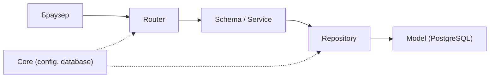

```mermaid
flowchart LR
    Browser["Браузер"] --> Router["Router"]
    Router --> Logic["Schema / Service"]
    Logic --> Repository["Repository"]
    Repository --> Model["Model (PostgreSQL)"]
    Core["Core (config, database)"] -.-> Router
    Core -.-> Repository
```
