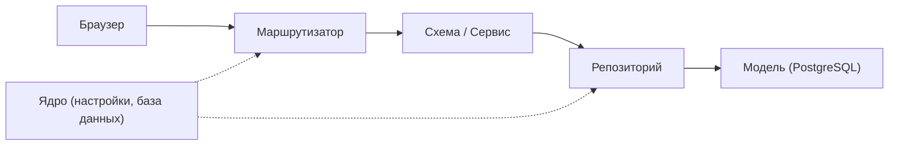

```mermaid
flowchart LR
    Browser["Браузер"] --> Router["Маршрутизатор"]
    Router --> Logic["Схема / Сервис"]
    Logic --> Repository["Репозиторий"]
    Repository --> Model["Модель (PostgreSQL)"]
    Core["Ядро (настройки, база данных)"] -.-> Router
    Core -.-> Repository
```
